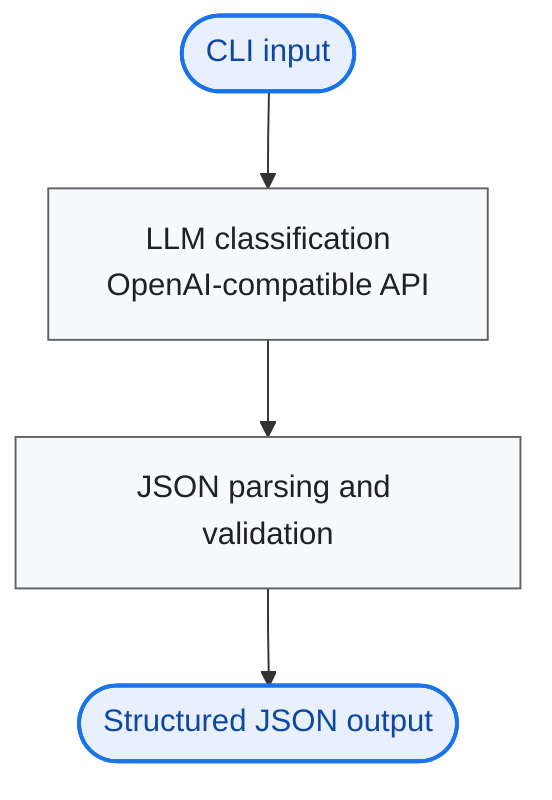
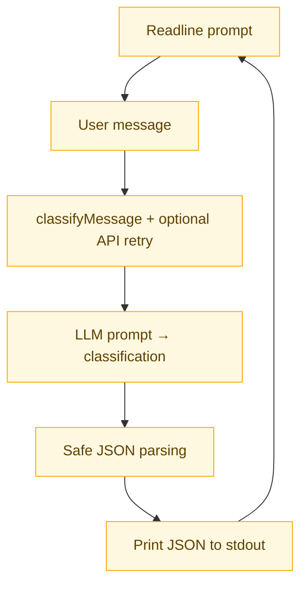

# AI Customer Support Message Classifier

This project classifies customer support messages into **category** and **priority** using a large language model. It calls an LLM through an **OpenAI-compatible chat API** (primarily **OpenRouter**), with optional **Google Gemini** (AI Studio), parses the model’s JSON reply, and prints a structured result from an **interactive CLI**.

---

## Visual workflow

Flowcharts render on GitHub and many Markdown viewers that support [Mermaid](https://mermaid.js.org/).

### Overview



### Pipeline detail



---

## Features

- **Interactive CLI** — Node.js `readline`; type a message, get a result; type **`exit`** to quit  
- **LLM-based classification** — strict prompt with fixed categories and priorities  
- **Strict JSON output** — each successful run prints `JSON.stringify(result, null, 2)`  
- **Resilient API calls** — **one automatic retry** after a 1s delay if the classification request fails  
- **Graceful CLI errors** — failures print to **stderr**; the session keeps running  

---

## Tech stack

| Area | Choice |
|------|--------|
| Runtime | Node.js (ESM) |
| LLM access | **OpenRouter** (OpenAI-compatible HTTP API); optional **Gemini** via `@google/generative-ai` (direct OpenAI remains supported in code via `.env.example`) |
| Language | JavaScript (ES modules) |

**Why OpenRouter instead of OpenAI directly?** The OpenAI account available for this work only supported **paid-credit** usage, so direct OpenAI API access was not practical. **OpenRouter** with an API key provides access to the same class of chat models through an **OpenAI-compatible** interface, which this project uses via the official `openai` Node SDK (`baseURL` set to OpenRouter).

---

## Setup

1. **Install dependencies**

   ```bash
   npm install
   ```

2. **Configure environment**

   Copy `.env.example` to `.env` and set at least one API key.  
   Example: `OPENROUTER_API_KEY` or `OPENAI_API_KEY`, or `GEMINI_API_KEY` / `GOOGLE_API_KEY` for Gemini.  
   Optional: `LLM_PROVIDER=openrouter|gemini|openai` to force a backend.

3. **Run**

   ```bash
   node index.js
   ```

---

## Usage

1. Start the app; you’ll see a prompt.  
2. Enter a customer message and press Enter.  
3. Read the JSON object printed below the prompt.  
4. Repeat, or type **`exit`** to leave.

---

## Sample input / output

**Typed message (example):**

```text
My payment got deducted but service is not activated
```

**Printed JSON (illustrative — exact labels depend on the model):**

```json
{
  "message": "My payment got deducted but service is not activated",
  "category": "Billing",
  "priority": "High"
}
```

If classification fails after the retry, an error message is printed to **stderr** and you can enter another message.

---

## Approach

- **Prompt engineering** — A strict classifier instruction defines categories (Billing, Technical Issue, Account, General Inquiry), priorities (High, Medium, Low), tie-break rules for vague or multi-issue text, and requires **JSON-only** replies with exactly two keys.  
- **JSON enforcement** — Responses are parsed defensively (e.g. fenced code blocks, embedded objects) and validated before building `{ message, category, priority }`.  
- **API retry** — `classifyMessage` runs the provider call twice at most: initial attempt, then **one** repeat after **1 second** if the first fails.  
- **Interactive loop** — `index.js` uses `readline` `question()` in a `while` loop until the user enters **`exit`**.
