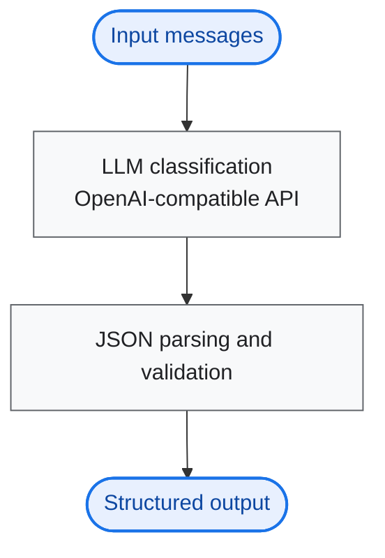
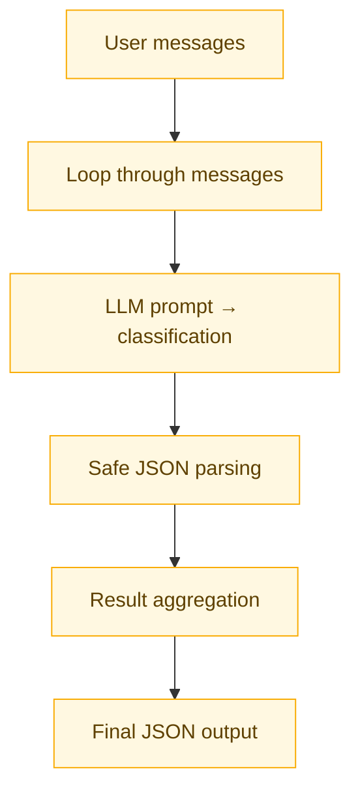

# AI Customer Support Message Classifier

This project classifies customer support messages into **category** and **priority** using a large language model. It calls an LLM through an **OpenAI-compatible chat API** (primarily **OpenRouter**), with optional **Google Gemini** (AI Studio), then parses and aggregates results into strict JSON.

---

## Visual workflow

### Overview



### Pipeline detail



---

## Features

- **Multi-message processing** — classify several messages in one run  
- **LLM-based classification** — categories and priorities from the model  
- **Strict JSON output** — `JSON.stringify` for valid, quoted JSON  
- **Error handling** — failed classifications become structured error rows; the run continues  
- **Rate limiting** — one-second delay between API calls  

---

## Tech stack

| Area | Choice |
|------|--------|
| Runtime | Node.js (ESM) |
| LLM access | **OpenRouter** (OpenAI-compatible HTTP API); optional **Gemini** via `@google/generative-ai` (direct OpenAI remains supported in code via `.env.example`) |
| Language | JavaScript (ES modules) |

**Why OpenRouter instead of OpenAI directly?** The OpenAI account available for this work only supported **paid-credit** usage, so direct OpenAI API access was not practical. **OpenRouter** with an API key provides access to the same class of chat models through an **OpenAI-compatible** interface, which this project uses via the official `openai` Node SDK (`baseURL` set to OpenRouter).

---

## Setup

1. **Install dependencies**

   ```bash
   npm install
   ```

2. **Configure environment**

   Copy `.env.example` to `.env` and set at least one API key (see `.env.example` for options).  
   Example: `OPENROUTER_API_KEY` or `OPENAI_API_KEY`, or `GEMINI_API_KEY` / `GOOGLE_API_KEY` for Gemini.

3. **Run**

   ```bash
   node index.js
   ```

---

## Sample input

The script uses these three messages (see `index.js`):

1. `My payment got deducted but service is not activated`  
2. `App crashes every time I login`  
3. `How to change my email address?`  

---

## Sample output

Illustrative result (exact `category` / `priority` values depend on the model):

```json
[
  {
    "message": "My payment got deducted but service is not activated",
    "category": "Billing",
    "priority": "High"
  },
  {
    "message": "App crashes every time I login",
    "category": "Technical Issue",
    "priority": "High"
  },
  {
    "message": "How to change my email address?",
    "category": "Account",
    "priority": "Low"
  }
]
```

If a call fails, that row uses `"category": "Error"` and `"priority": "Error"` while other rows still classify normally.

---

## Approach

- **Prompt engineering** — A fixed system-style instruction defines allowed categories (Billing, Technical Issue, Account, General Inquiry), priorities (High, Medium, Low), and requires **JSON-only** replies.  
- **JSON enforcement** — Responses are parsed defensively (e.g. fenced code blocks, embedded objects) and validated before building each result object.  
- **Loop-based processing** — Messages are handled sequentially with a short delay between requests to reduce rate-limit risk.  
- **Error handling** — Per-message `try` / `catch` records failures as explicit error objects so the batch still produces a complete JSON array.
